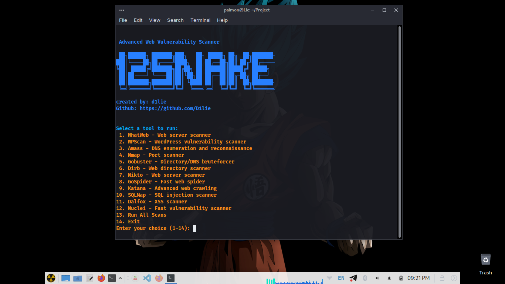

# 12SNAKE - Advanced Web Vulnerability Scanner
████╗██████╗ ███████╗███╗ ██╗ █████╗ ██╗ ██╗███████╗
███║╚════██╗██╔════╝████╗ ██║██╔══██╗██║ ██╔╝██╔════╝
╚██║ █████╔╝███████╗██╔██╗ ██║███████║█████╔╝ █████╗
██║██╔═══╝ ╚════██║██║╚██╗██║██╔══██║██╔═██╗ ██╔══╝
██║███████╗███████║██║ ╚████║██║ ██║██║ ██╗███████╗
╚═╝╚══════╝╚══════╝╚═╝ ╚═══╝╚═╝ ╚═╝╚═╝ ╚═╝╚══════╝

Created by: d1lie

12SNEKA is an advanced web vulnerability scanner designed to identify security weaknesses in web applications.

<p align="center">
  
</p>


## Features

- Comprehensive web vulnerability scanning
- Multiple scanning techniques
- User-friendly interface
- Regular updates with new detection methods

## Installation

### Quick Start

```bash
sudo apt update && sudo apt-get update
sudo apt -y upgrade && sudo apt-get -y upgrade
git clone https://github.com/D1lie/12SNEKA.git
cd 12SNEKA
chmod +x 12sneka.sh
./12sneka.sh
